# 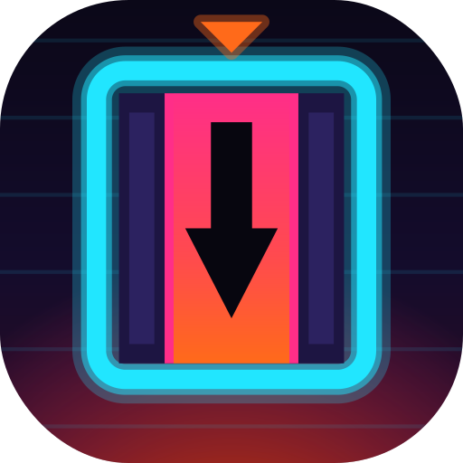 'Bout That Action

*"I'm just 'bout that action, boss."*

An endless, portrait-only Android action game. It's a hyper-modern, neon-noir
take on the arcade classic **Elevator Action**, with a little **Metal Gear
Solid** cardboard box mixed in. A helicopter drops you on the roof of a
skyscraper. Then you go down, and down, and down: through the tower, under
the city, through the Earth's crust and the magma core, into **Hell**, and
past it into a Void where anything goes.

Everything is generated: procedural floors, procedural soundtrack,
procedural sound effects. No asset files, no ads, no network.

<div align="center">
  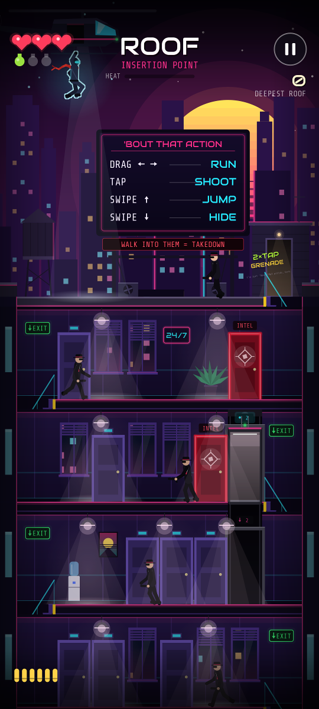
  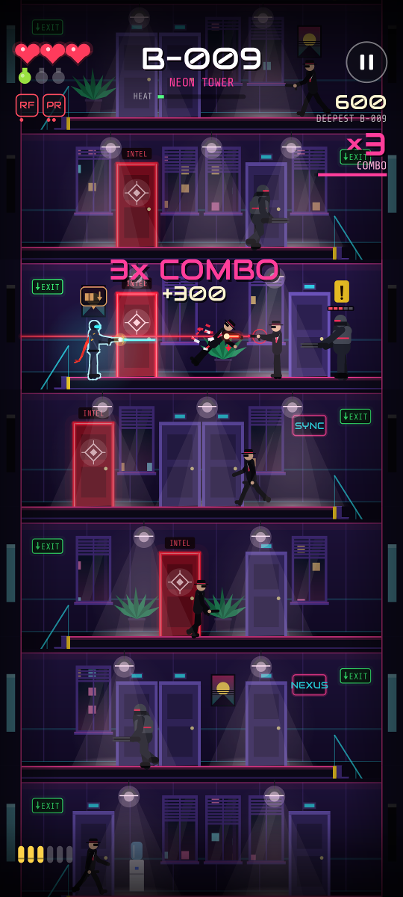
  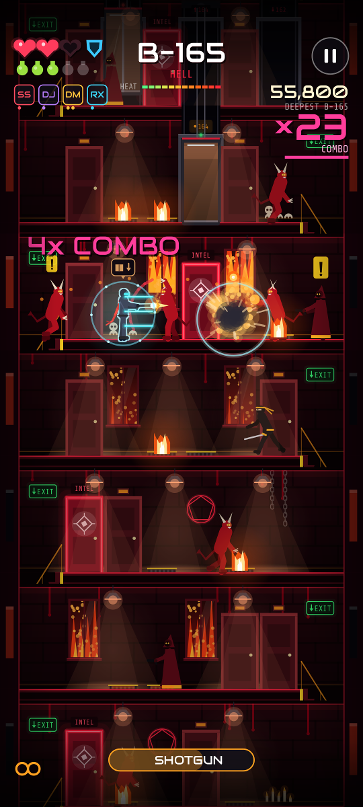
  <p><em><b>Rooftop</b> insertion · <b>Neon Tower</b> firefight · <b>Hell</b>, floor 165</em></p>
</div>

## Controls

Built for thumbs. Every gesture works anywhere on the screen, and each finger
is read on its own, so one thumb can run while the other shoots.

| Gesture | Does |
|---|---|
| **Drag ← →** and hold | Run. Nudge back a little to turn around instantly. Lift to stop. |
| **Tap** | Shoot. Auto-aims at the nearest threat, high or low. Fires on release, no delay. |
| **Double-tap** | Throw a grenade. |
| **Swipe ↑** | Jump. Clears low shots; land on heads to stomp. Works mid-run. |
| **Swipe ↓** | Hide: press into a **doorway**, pop the **cardboard box**, ride an open **elevator** down, or enter a red **INTEL** door. |
| **Walk into an enemy** | Instant silent **takedown**. Heavies only from behind. |
| **Jump + tap** | Shoot out a ceiling light. It crushes whoever is under it and blacks out the floor. |

A small arrow above your head shows what swipe ↓ will do right now. An
optional thumb guide shows where your run drag started, and **Auto-fire**
(in settings) shoots anything in sight for you.

## How it plays

- **The Elevator Action rules, modernized.** The stairs zigzag, so you
  cross every floor. Guards step out of doors already looking for you.
  Alert guards duck under your high shots and answer low, so you duck,
  jump and re-aim. Elevators are shortcuts, and you're exposed whenever
  their doors are open.
- **Stealth pays.** Gunfire alerts everyone nearby; takedowns are silent.
  In the box, guards lose you and high shots sail over your head.
- **Roguelike runs.** Every red INTEL door offers three perks, and they
  stack: Rapid Fire, Pierce, Ricochet, Split Shot, CQC Master, Ghost Box,
  Double Jump, Demolition, Reflex (auto bullet-time), Kevlar, Shockwave
  stomps and more. Enemies drop shotguns, miniguns, shields, bullet time,
  medkits and cash.
- **Endless and seeded.** Any floor can be rebuilt from `(seed, floor)`, so
  the building never ends and never uses more memory. The same seed plus the
  same difficulty gives the same building, so you can share a seed or play
  the **daily** building.

<table>
  <tr>
    <td align="center" width="33%">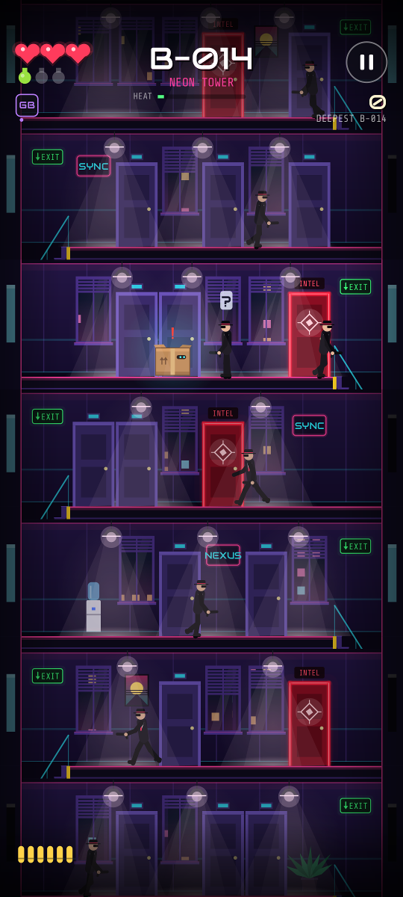<p><em><b>The box.</b> "?"</em></p></td>
    <td align="center" width="33%">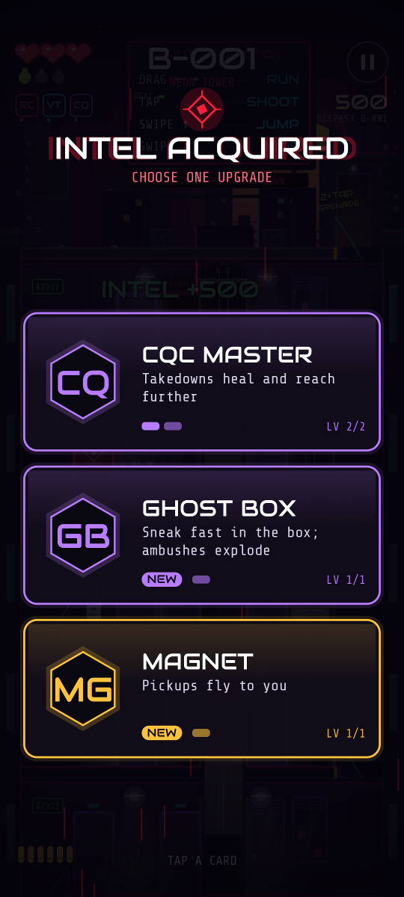<p><em><b>INTEL</b>: pick one of three</em></p></td>
    <td align="center" width="33%">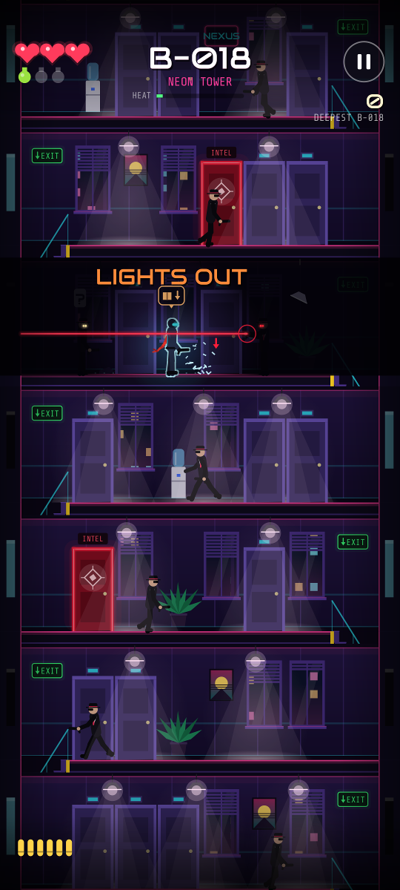<p><em><b>Lights out.</b> They can't see you either</em></p></td>
  </tr>
</table>

## The descent

| Floors | Zone | Vibe |
|---|---|---|
| Roof | **Rooftop** | Helicopter drop, skyline, the tutorial on a billboard |
| 1–24 | **Neon Tower** | Corporate synthwave, 118 BPM |
| 25–49 | **Black Labs** | Laser grids, drones, cold techno |
| 50–74 | **Deep Metro** | Steam vents, turrets, breakbeats |
| 75–99 | **Iron Mines** | The crust. Industrial clank |
| 100–149 | **Magma Core** | Lava vents, darksynth |
| 150–199 | **Hell** | Demons and fireballs at 165 BPM. Built to be (nearly) impossible |
| 200+ | **The Void** | Every block of floors rolls a random zone and a random, brutal heat |

<table>
  <tr>
    <td align="center" width="25%">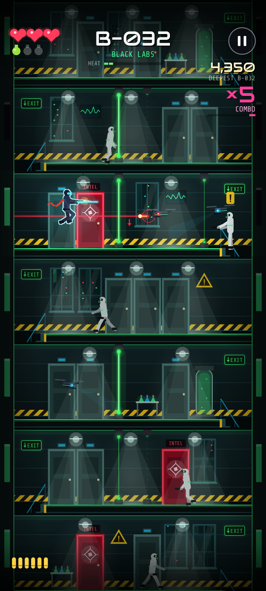<p><em>Black Labs</em></p></td>
    <td align="center" width="25%">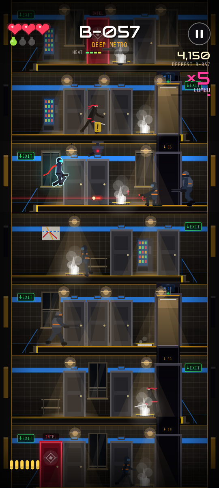<p><em>Deep Metro</em></p></td>
    <td align="center" width="25%">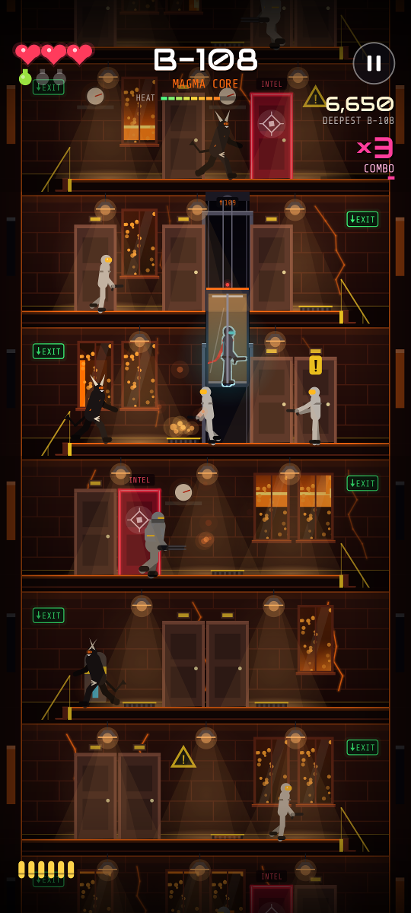<p><em>Magma Core</em></p></td>
    <td align="center" width="25%">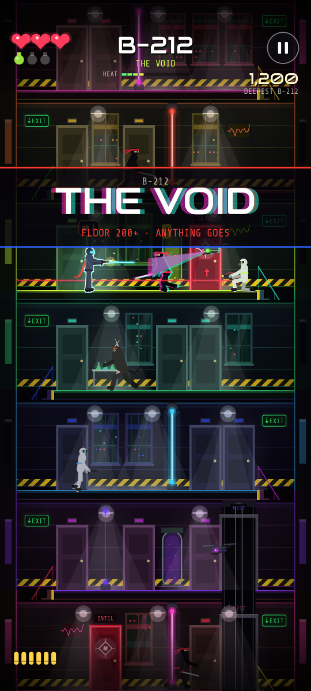<p><em>The Void</em></p></td>
  </tr>
</table>

## Difficulty and seeds

Everything scales from one number, **heat**: enemy reaction time, fire rate,
bullet speed, hit points, how many enemies there are, how fast doors spit out
reinforcements, and how many hazards a floor has. Each zone adds its own
bonus, and Hell adds a lot. Pick a preset or shape your own curve:

- **Chill:** slow ramp, 5 hearts.
- **Agent:** the intended descent.
- **Brutal:** hot start, steep ramp, 2 hearts.
- **Straight to Hell:** start on floor 150. Good luck.
- **Custom:** starting heat, ramp, heat cap, hearts, and the zone you start in,
  with a live preview of the curve.

Seeds can be **random**, **daily** (same building for everyone, UTC), or any
word or number you type.

## Sound

The soundtrack is synthesized live: band-limited oscillators, filters,
drums, delay and reverb. Every zone gets its own procedural track, with its
own key, tempo and motif-based melodies. The music gets more intense in a
fight and pitches down in bullet time. Every sound effect is
synthesized too, panned to where it happened on screen, with haptics on the
big moments.

## Install

Grab `bout-that-action.apk` from the [latest release](../../releases/latest)
and sideload it. Every push to `main` publishes a single date-labeled release
(`vYYYY.MM.DD.N`) and deletes the previous one; verify it with the attached
`.sha256`. Releases need the signing secrets described in `AGENTS.md`. Until
they're set, CI builds and tests but publishes nothing.

Android 17 (API 37) or newer only. See `AGENTS.md` for the latest-only
policy. The only permission is vibration.

## Build and test

```sh
./gradlew lint test assembleDebug   # what CI runs (plus assembleRelease)
./gradlew :app:screenshots          # re-render docs/screenshots
```

The whole game (simulation, touch controls, renderer and synth) is pure
Kotlin behind small interfaces, so it's tested on the JVM:

- `MechanicsTest`: every rule, one scripted situation at a time (takedowns,
  box vs high shots, jumping low shots, doors, elevators, intel, lights,
  stomps, grenades, combos, ammo, noise, ducking duels, death, replays).
- `LevelGenTest`: determinism, the zigzag, no overlaps, shaft consistency,
  zone order, the heat curve.
- `GestureInputTest`: taps, double-taps, flicks mid-run, instant reversal,
  two-thumb play.
- `BotPlaythroughTest`: an autopilot plays full runs on every preset and
  prints a balance report. The same autopilot plays the demo behind the
  title screen.
- `WorldFuzzTest`: minutes of random thumbs on every preset.
- `ScreenshotTest`: renders the README screenshots headlessly through the
  real renderer, using a `java.awt` backend.
- Audio tests: DSP, music theory, levels, determinism, and a check that it
  renders faster than real time.
- `GameplaySmokeTest` (emulator): drops into a run and plays with injected
  touches. CI boots an API 37 emulator for it.

## License

MIT. Fonts: Audiowide and Share Tech Mono, both under the SIL Open Font
License (`licenses/`).
