#  'Bout That Action

An endless, portrait-only Android action game: a hyper-modern, neon-noir
spy caper in the spirit of the 80s arcade, with a cardboard box to hide in.
A helicopter drops you on the roof of a
skyscraper. Then you go down, and down, and down: through the tower, under
the city, through the Earth's crust and the magma core, into **Hell**, and
past it into a Void where anything goes.

Everything is generated: procedural floors, procedural soundtrack,
procedural sound effects. No asset files, no ads, no network.

<div align="center">
  
  
  
  <p><em><b>Rooftop</b> insertion · <b>Neon Tower</b> firefight · <b>Hell</b>, B115</em></p>
</div>

## Controls

Built for thumbs. Every gesture works anywhere on the screen, and each finger
is read on its own, so one thumb can run while the other taps.

| Gesture | Does |
|---|---|
| **Drag ← →** and hold | Run. Nudge back a little to turn around instantly. Lift to stop. A held run won't pull you out of a doorway or elevator: lift and drag again to step out. |
| **Tap** | Interact with what you're standing at: go through a green **passage** door into another hallway, enter a gold **STASH** door (locked while you're being hunted), ride an open **elevator** down, or call a closed one. With nothing in reach, a tap does nothing. |
| **Swipe ↓** | Hide: press into a nearby **doorway**, otherwise pop the **cardboard box**. In an elevator, box up in the car. Swipe ↓ again to stand up. In a doorway, a tap or a swipe ↑ also steps you out. |
| **Swipe ↑** | Jump. Clears low shots. Land on a head to **BONK** him: he's dazed for 1.6 s and yours to take down from any side (a Heavy still from behind: hop over him; the BULL stomps him flat instead; a drone breaks under anyone; the MONKEY just hops off). Works mid-run. |
| **Walk into an enemy's back** | Instant silent **takedown**. Face to face only when he can't fight it: asleep, dazed, or walking into your box. The FOX, and the BULL with STIFF ARM, take guards down face to face anyway; Heavies want their back even when dazed (a napping one is fair game, and STIFF ARM tackles them head-on). Walk into anyone else's front and he's onto you. Works in GUNS HOT too: the gun never shoots a guard with his back to you. (Not the MONKEY: he has no takedowns, and walking into a guard just gets him noticed, so his gun shoots turned backs instead.) |
| **Grenade button** (under the mode button) | Throw a grenade, in either mode. The lime button shows how many you carry and greys out when you're empty. Taps never throw one, so hammering a door is always just the door. |
| **Jump + tap** | Under a ceiling lamp: swat it out by hand. The hallway gets darker, the fixture drops on anyone right under it (never on you), and the crash of glass brings nearby guards over to look: lure them in, then grab them from the shadows. Works in both modes. |
| **Mode button** (under pause) | **GUNS HOT**: you auto-fire at threats in range. **SILENT**: you never fire; guards only notice what they see, and quiet kills pay double. Flip it any time (it's the only place to); your choice sticks between runs. The MONKEY is **always GUNS HOT**: his button wears a padlock and says ALWAYS HOT, and tapping it just gets an "OOK?". |

A chip over your head shows what a tap (or a swipe ↓) will do right now, and
the hallway map in the corner shows where you've been and which hallways have
a ride down. An optional thumb guide shows where your run drag started.
Inputs are forgiving: a gesture made a hair early is buffered, and a bullet
that lands the same instant you dodge counts as a miss ("CLOSE!"). On a run
from the roof, **coach tips** pop up the first time each move would help
("SWIPE DOWN: HIDE"); turn them off in Settings. Design
notes and every threshold are in [`docs/CONTROLS.md`](docs/CONTROLS.md).

## How it plays

- **Every floor is a little puzzle.** A floor is two to four hallways joined
  by passage doors, and the whole hallway is always on screen. You arrive in
  hallway **A**; the ride down is always somewhere else. A lift only shows in
  the hallway it opens into; the passage plates and the HALLS map mark the
  hallways with a ride down, so you always know where you're headed. A ride
  down glows cyan with ▼ chevrons chasing down its doors; the car you came in
  on is plain steel with a red DO NOT ENTER sign. Your
  floor is the stage: the floor below, where you're headed, is a step back,
  and the rest of the tower recedes into the dark. The choice is how: which
  door, which hallway's guards, which lift, and when to move.
- **Elevators are the only way down.** No stairs. Most shafts are short 1–2
  floor hops. Rare gold **express** shafts drop 3–5 floors at once, but open
  their doors once on the way, onto someone waiting. Cars wait behind closed
  landing doors until called: tap a landing to call one, and hide while it comes.
- **Guns hot or silent.** In GUNS HOT the gun fires itself at whoever is about
  to hurt you first (it answers a raised gun, so a guard across the hallway
  who spots you gets his shot), and leaves guards who haven't spotted you to
  you (except the MONKEY's, which also takes any guard with his back turned).
  In SILENT you never fire: take guards from behind, bonk
  them from above, wait them out in a doorway or under the box, lure them into
  hazards, or black out the lights. Guards take longer to react to a shadow,
  and every quiet kill is worth double. Flip modes any time (the MONKEY
  can't: he's always GUNS HOT, and he's spray-painted the rooftop billboard
  to say so).
- **Patrols you can time.** Guards walk a regular beat and stop to look
  around at each end. A couple per hallway, and the doors only rarely spit
  out more. In the box, a patrol that walks into you gets ambushed (BOX'D!).
  Guards who spot you the instant you step into a hallway give you a beat
  to take it in first.
- **The box is a lure.** Move it while a guard is looking right at it and he
  stops ("HUH?") and comes over to check. Let him. Heavies and ninjas aren't
  fooled: they kick the box off. Leave a floor without anyone spotting you
  and it's a **GHOST** bonus (double in SILENT).
- **No vanishing acts.** Hide *before* they see you. A guard who is already
  on to you and watches you duck into a doorway or under the box knows where
  you went: he walks over and pulls you out ("FOUND YOU!") or kicks the box
  off. Anyone who didn't see you go walks right past.
- **Special floors.** About one floor in six is something else: a
  **BLACKOUT** (every light dead, for them too), **NAP TIME** (guards asleep
  at their posts, called out the first time you walk in on one: tiptoe up for
  a NIGHT NIGHT), or **PAYDAY** (somebody left
  the loot lying around). Some rides come with smooth jazz. The first guard
  of every run is napping on the roof.
- **Roguelike runs.** Every gold STASH door offers three perks (it's
  **LOCKED** while anyone in the hallway is hunting or searching for you:
  drop them or lose them first), and they
  stack: Rapid Fire, Hollow Point, Pierce, Ricochet, Split Shot, Vitality,
  CQC Master, Ghost Box, Double Jump, Demolition, Magnet, Reflex (auto
  slow-mo), Vest, Lucky and Shockwave bonks, plus three that only your
  [hero](#heroes) ever finds. Enemies drop shotguns,
  miniguns, shields, slow-mo, grenades, medkits and cash. The gun perks
  and gun drops only matter in GUNS HOT; SILENT never fires.
- **Endless and seeded.** Any floor can be rebuilt from `(seed, floor)`, so
  the building never ends and never uses more memory. The same seed plus the
  same difficulty gives the same building, so you can share a seed or play
  the **daily** building.

<table>
  <tr>
    <td align="center" width="33%">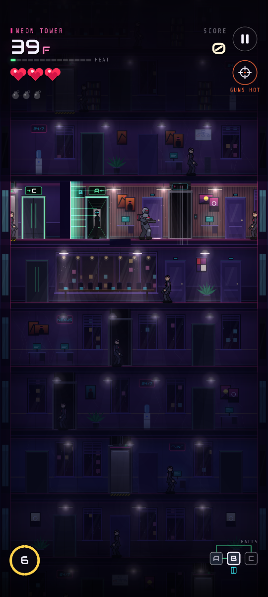<p><em><b>Passages.</b> Whoosh: hallway B</em></p></td>
    <td align="center" width="33%">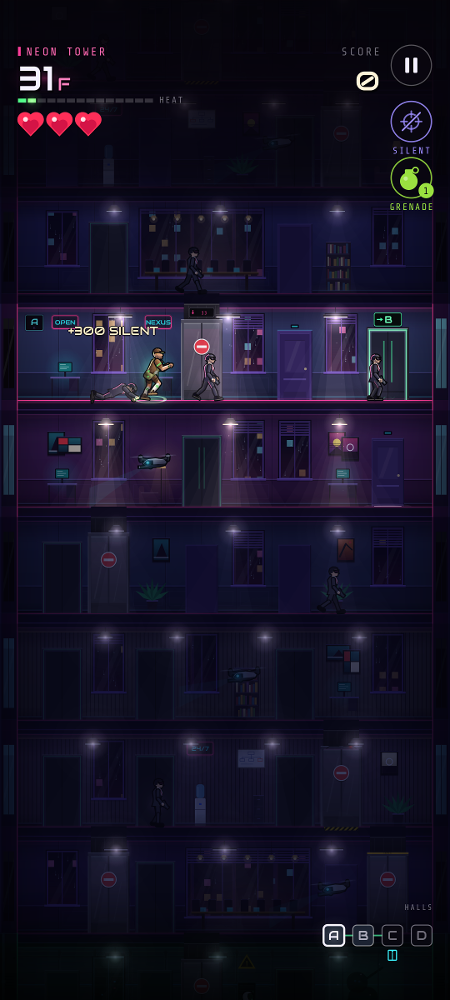<p><em><b>SILENT.</b> From behind, for double</em></p></td>
    <td align="center" width="33%">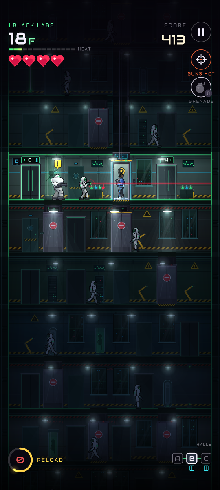<p><em><b>Express.</b> The doors open on the way</em></p></td>
  </tr>
  <tr>
    <td align="center" width="33%"><p><em><b>The box.</b> "?"</em></p></td>
    <td align="center" width="33%">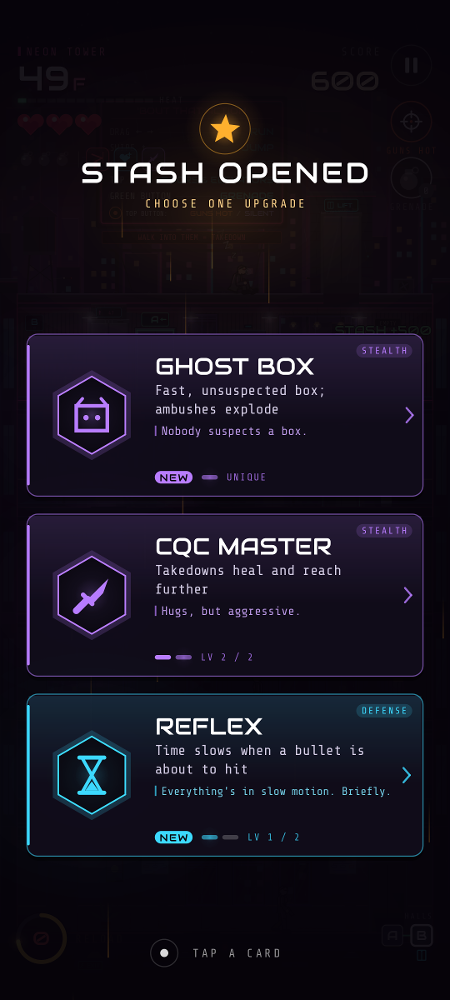<p><em><b>STASH</b>: pick one of three</em></p></td>
    <td align="center" width="33%"><p><em><b>Lights out.</b> They can't see you either</em></p></td>
  </tr>
  <tr>
    <td align="center" width="33%">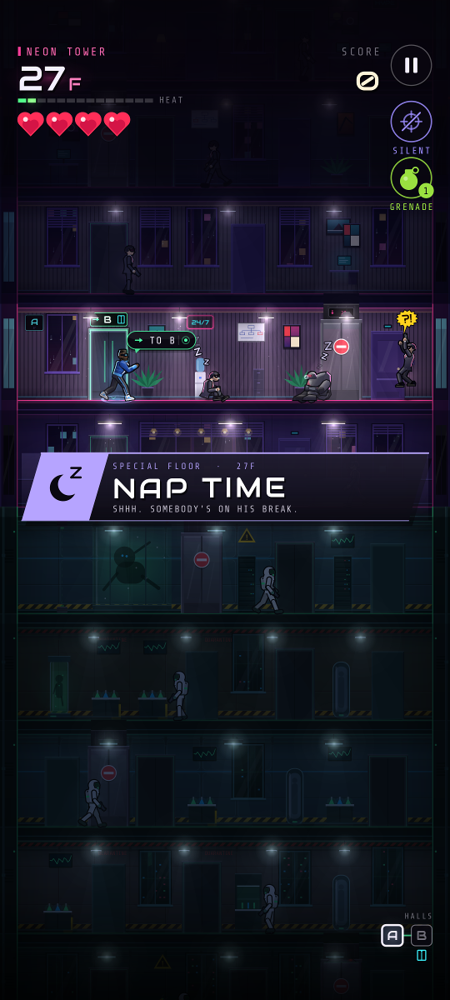<p><em><b>Nap time.</b> Zzz. Tiptoe</em></p></td>
    <td align="center" width="33%">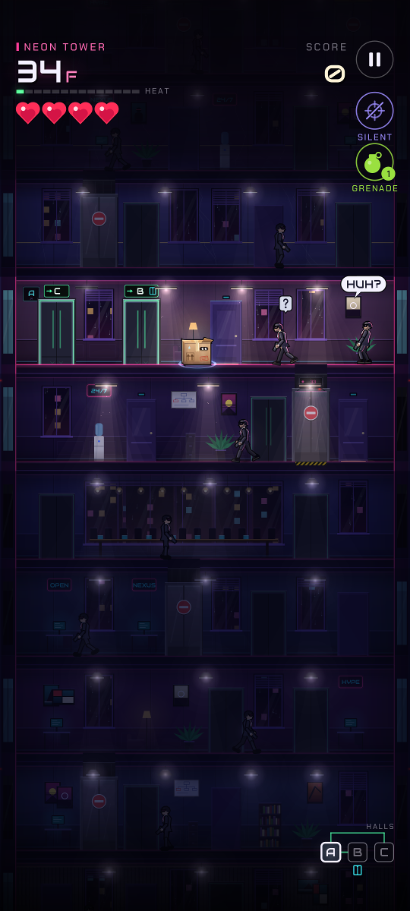<p><em><b>HUH?</b> The box moved</em></p></td>
    <td align="center" width="33%">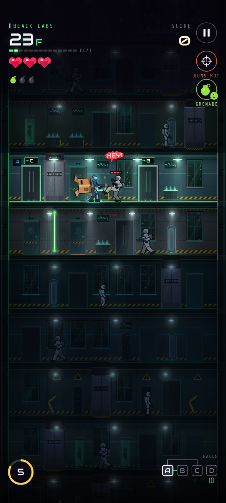<p><em><b>HEY!</b> Heavies aren't fooled</em></p></td>
  </tr>
  <tr>
    <td align="center" width="33%">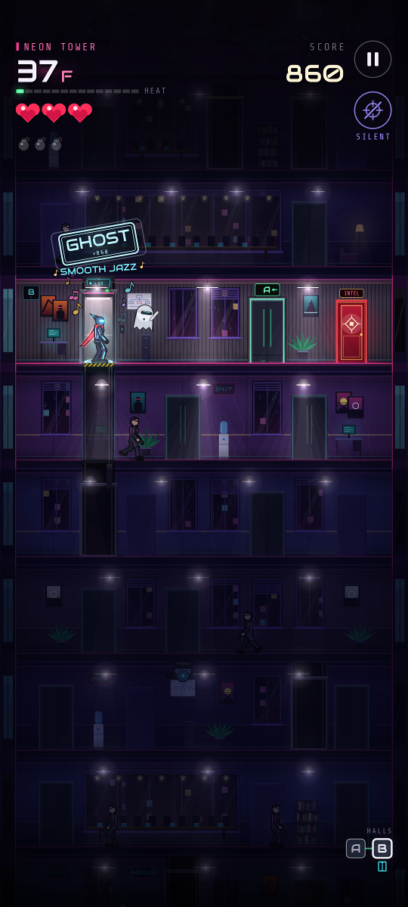<p><em><b>GHOST.</b> Nobody saw a thing</em></p></td>
    <td align="center" width="33%">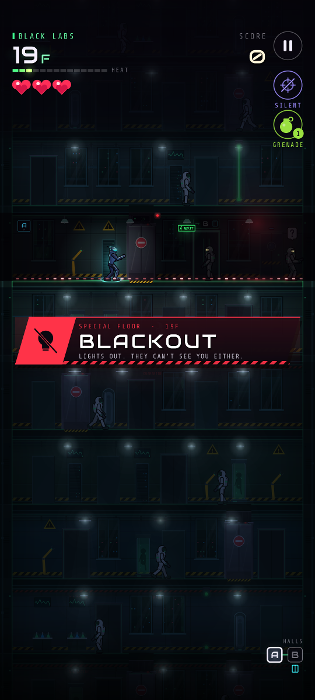<p><em><b>Blackout.</b> Follow the red lights</em></p></td>
    <td align="center" width="33%">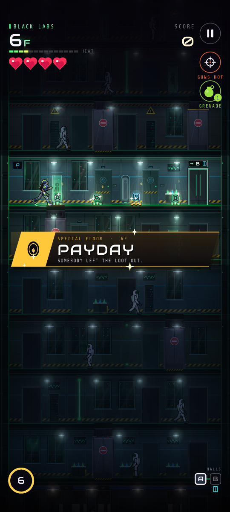<p><em><b>Payday.</b> Somebody's bonus</em></p></td>
  </tr>
  <tr>
    <td align="center" width="33%">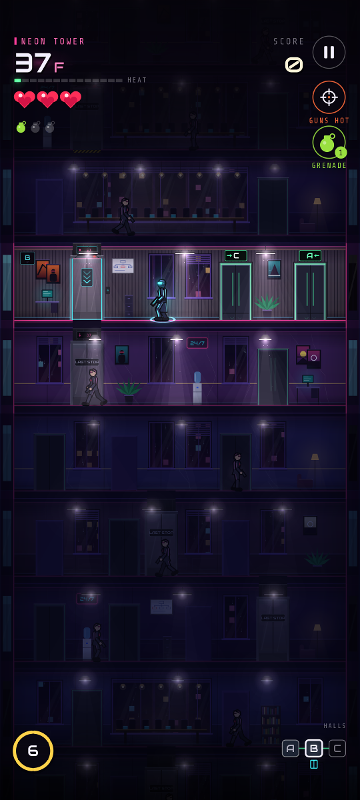<p><em><b>Lifts.</b> Cyan goes down; red means no entry</em></p></td>
    <td align="center" width="33%">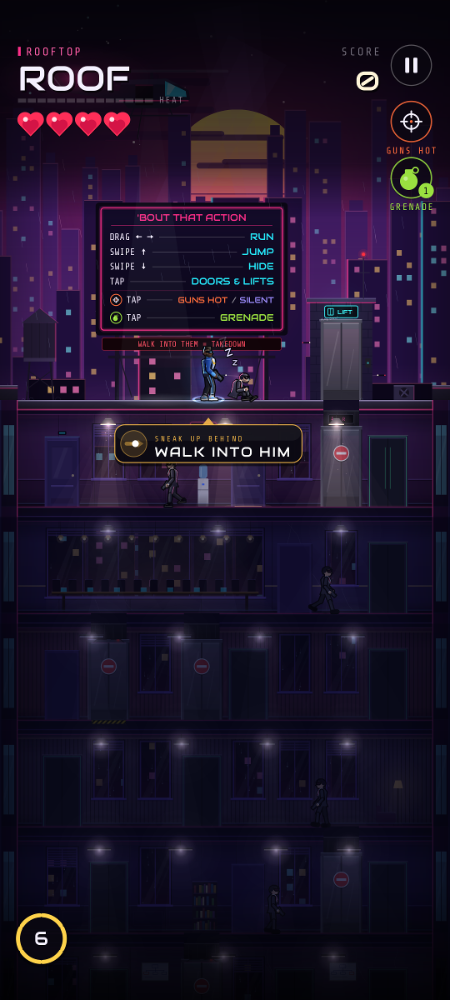<p><em><b>Coach.</b> Tips, once each</em></p></td>
    <td align="center" width="33%">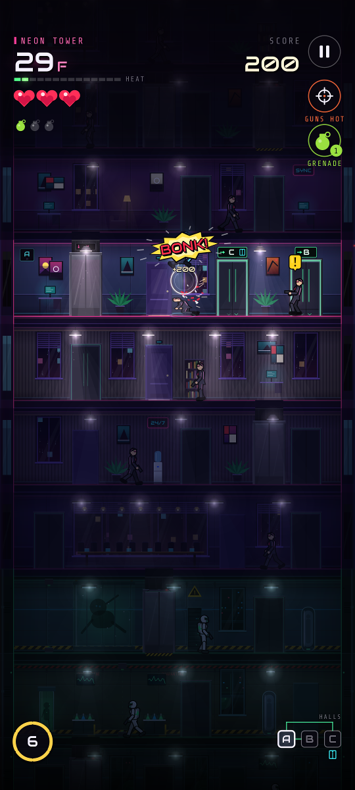<p><em><b>BONK!</b> Mind the lamp</em></p></td>
  </tr>
  <tr>
    <td align="center" width="33%">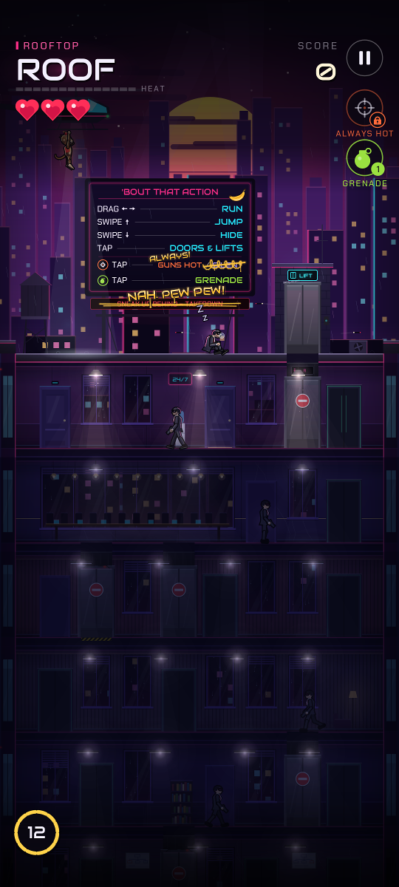<p><em><b>MONKEY.</b> He got to the billboard first</em></p></td>
  </tr>
</table>

## Heroes

<p align="center">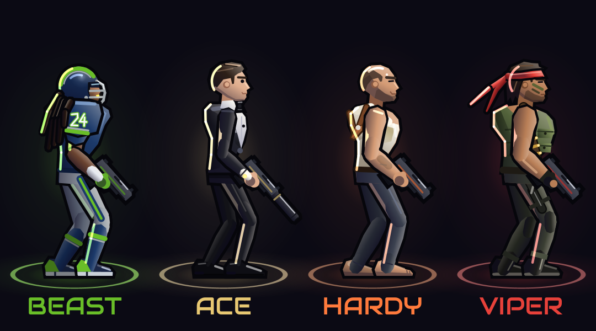</p>

Pick who's going down on the title screen. Every hero plays the same
building, but with a different body: an always-on trait, three perks only
they find in a STASH, their own look and their own take on every zone's
music.

| Hero | Who | Trait (always on) |
|---|---|---|
| **BULL** | A heavyweight in a quilted bomber, shades and a gold chain. Tough, fast, bulldozes. | +1 heart, runs 10% faster, and the only one who stomps heads flat (everyone else's landing just dazes a guard) |
| **FOX** | A martial-arts brawler in a black sports bra, baggy grey fighting pants, red gloves and red shoes, a long, glossy black ponytail whipping behind her. Kicks first, questions never: the takedown specialist. | Takes guards down face to face (Heavies still only from behind), takedowns reach 0.35 u further (long legs), a 15% quicker trigger; guards take 35% longer to react once they spot her |
| **HAWK** | A deadpan parcel courier in brown shorts, knee socks and a cap, scanner glowing, who lives in a cardboard box (naturally): the SILENT specialist. Goes postal, politely. | Unplugs drones and turrets by hand, like a takedown (quiet, and not while one is aiming at him); in SILENT guards spot him from a quarter less far; the box glides (2.2 u/s instead of 1.3) and never looks suspicious moving; reloads 25% faster |
| **MONKEY** | A small monkey with a very big gun, on the run from the circus: the weapons specialist. Oo oo. Ah ah. Pew pew. | A 12-round rifle (instead of a 6-round pistol) and pickup guns last 50% longer. He's short (0.95 u), so guards' straight high shots sail over his head (fireballs still come down on him); they know it and aim low more often (at least 70% of the time), and drones dip to his height. No takedowns, no stomps, no SILENT: walking into a guard just gets him noticed, landing on a head is a hop off it, and he's always GUNS HOT (the mode button is locked). Since he can't sneak up on anyone, his gun also shoots a guard with his back turned from anywhere in range |

Their perks:

- **BULL.** *Stiff Arm*: takedowns face to face, Heavies too (a head-on
  tackle), and run into a guard and he's flattened on the spot, even
  mid-swing, and you keep running. *Aftershock* (2 levels): every
  takedown dazes everyone within a quarter of the hallway for 1.8 s
  (nearly half of it at LV 2). *Candy
  Rain* (2 levels): every 8th kill heals a heart (every 5th at LV 2).
- **FOX.** *Showstopper*: guards take twice as long again to react.
  *Spin Kick* (2 levels): every takedown also kicks the nearest guard
  within 2.2 u flat (the nearest two at LV 2). *Flying Kick*: jump into a
  guard and your boots knock him out cold, Heavies from the front and ninjas
  mid-swing too (come down on his head and it's just a bonk).
- **MONKEY.** *Banana Clip* (2 levels): +6 rounds a magazine and reloads
  25% faster, per level. *Monkey See*: pickup guns last twice as long, and
  guards drop them two and a half times as often. *Shush*: quiet shots. They
  don't alarm anyone, and his gun picks off guards who haven't noticed him
  without waiting for them to draw (sleepers too). He's never offered CQC
  MASTER or SHOCKWAVE, which need takedowns and head landings.
- **HAWK.** *Signed For*: drones and turrets take twice as long to react to
  him. *Packing Peanuts* (2 levels): a grenade also bursts into peanuts that
  daze everyone in the hallway, machines too, for 2 s (3.5 s at LV 2).
  *Fragile* (2 levels): 1 in 4 hits miss you (1 in 3 at LV 2).

Each hero is an original character built on a genre archetype: no real
names, no logos, no team colors, nobody else's character.

## The descent

You only ever go down, one elevator at a time. Floors count down like a real
building, and the zone (and its music and heat) comes from the floor.

| Floors | Zone | Vibe |
|---|---|---|
| ROOF | **Rooftop** | Helicopter drop, skyline, the tutorial on a billboard, the penthouse lift |
| 49F–26F | **Neon Tower** | Corporate synthwave, 118 BPM |
| 25F–1F | **Black Labs** | Laser grids, drones, cold techno |
| B0–B24 | **Deep Metro** | Steam vents, turrets, breakbeats |
| B25–B49 | **Iron Mines** | The crust. Industrial clank |
| B50–B99 | **Magma Core** | Lava vents, darksynth |
| B100–B149 | **Hell** | Demons and fireballs at 165 BPM. Built to be (nearly) impossible |
| B150+ | **The Void** | Every block of floors rolls a random zone and a random, brutal heat |

<table>
  <tr>
    <td align="center" width="25%"><p><em>Black Labs</em></p></td>
    <td align="center" width="25%"><p><em>Deep Metro</em></p></td>
    <td align="center" width="25%"><p><em>Magma Core</em></p></td>
    <td align="center" width="25%"><p><em>The Void</em></p></td>
  </tr>
</table>

## When it's over

The game-over card tells the story of the run: a playstyle title
("CARDBOARD ENTHUSIAST", "BONK SPECIALIST", "THE GHOST"), what got you
("Steamed like a dumpling"), your highlights, and a sign-off ("Cardboard
remains undefeated."). No streaks, no daily rewards, no timers asking
you back. The building will still be there.

## Challenges

<table>
  <tr>
    <td align="center" width="33%">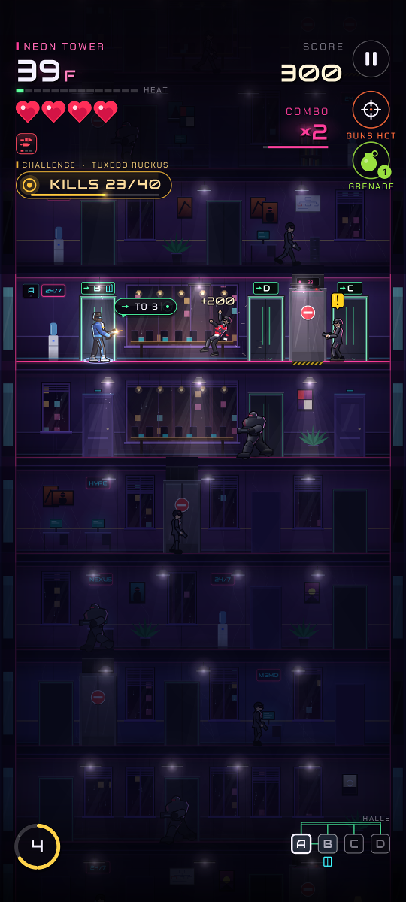<p><em><b>On the HUD.</b> The goal, ticking up</em></p></td>
    <td align="center" width="33%">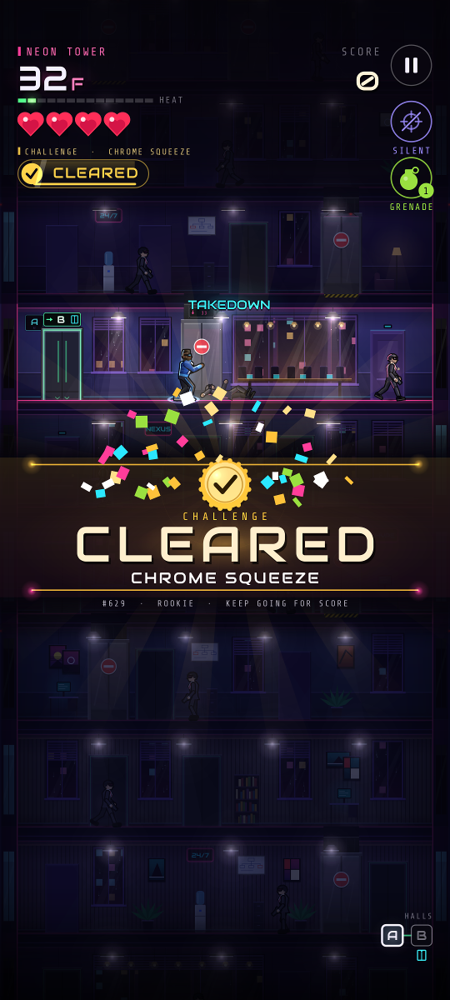<p><em><b>Cleared!</b> Then keep going for score</em></p></td>
    <td align="center" width="33%">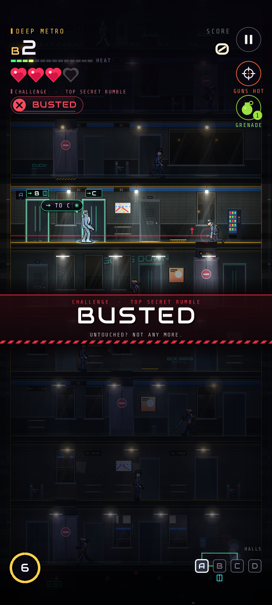<p><em><b>Busted.</b> UNTOUCHED, touched</em></p></td>
  </tr>
</table>

1,550 challenges, each with a silly name ("VELVET
LANTERN", "BULL IN A CHINA SHOP", "BARREL OF MONKEYS"), a goal and maybe a
twist or two:

- **Goals** come from the run's own numbers: reach a floor, take guards out,
  take them down, silent takeouts, ghosted floors, score, box ambushes, bonks,
  naps, lamps, blasts, combos, traps, close calls, STASHES, express rides and
  pickup-gun kills.
- **Twists:** SILENT ONLY or GUNS HOT ONLY (the mode is locked), ONE HEART,
  UNTOUCHED (one hit and the challenge is busted; the run goes on), a start
  zone, or the CHILL or BRUTAL curve.
- **Heroes** get their own: BULL stomps guards flat and STIFF ARMs them,
  FOX flying- and spin-kicks, HAWK unplugs robots and delivers from the box,
  and MONKEY lets shots sail over his head and goes bananas with pickup guns.
  A challenge never asks the impossible: no takedowns or SILENT for MONKEY,
  no shots under SILENT ONLY.
- **Five tiers**, ROOKIE to LEGEND, tuned against the autopilot: it clears
  most ROOKIEs and the odd LEGEND.

Each challenge always plays the same building, so everyone gets the same
floors. The goal sits on the HUD under your hearts and pops each time it moves;
clearing it is a big gold moment, and then the run carries on for score.

**The daily challenge** is the same for everyone on the same (local) day:
gentle on Monday, building to a LEGEND on Sunday. Already cleared that one on
an earlier day? You get a stand-in, picked the same way for everyone who's
cleared the same ones. Clear today's and it stays today's, marked cleared.
There are no streaks, rewards or countdowns: every challenge is playable any
day from the board, and nothing nags you to come back.

## The front end

<table>
  <tr>
    <td align="center" width="20%">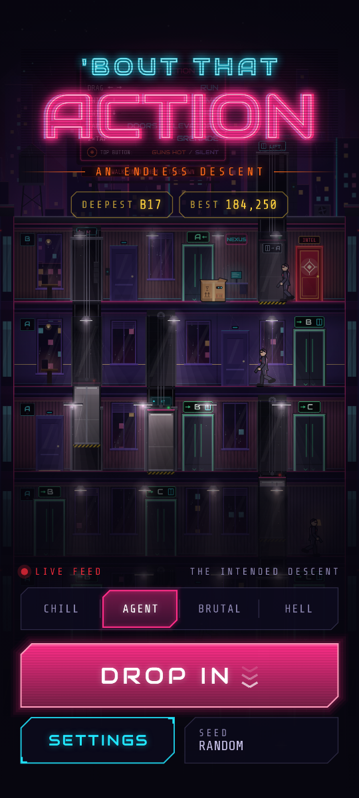<p><em><b>Title</b>: a neon sign over a live autopilot run</em></p></td>
    <td align="center" width="20%">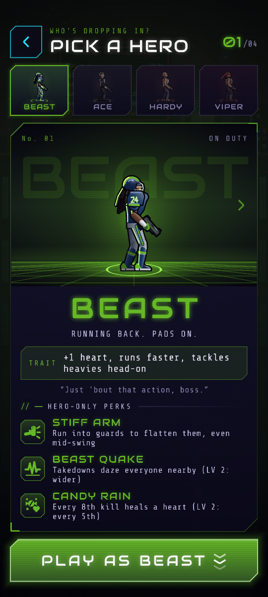<p><em><b>Heroes</b>: swipe through all four</em></p></td>
    <td align="center" width="20%">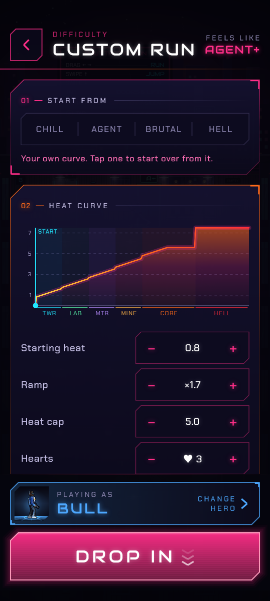<p><em><b>Custom run</b>: shape your own heat curve</em></p></td>
    <td align="center" width="20%">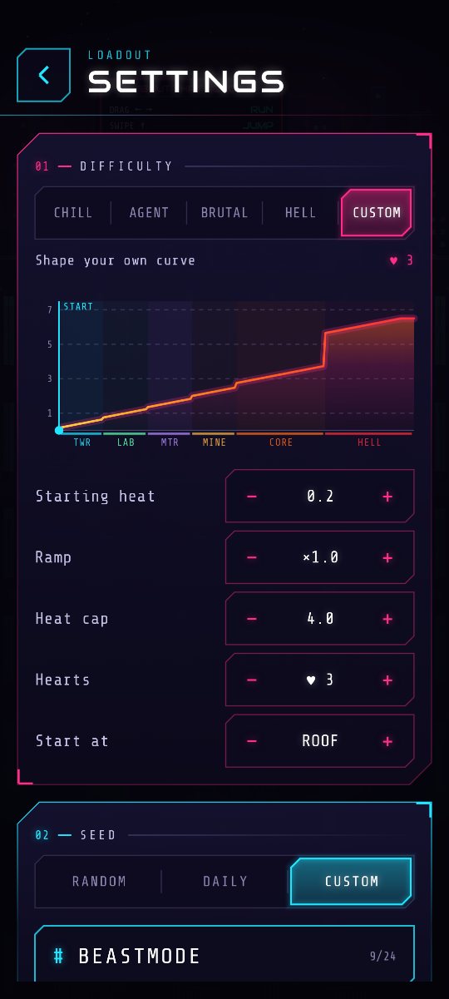<p><em><b>Settings</b>: seed, sound and controls</em></p></td>
    <td align="center" width="20%">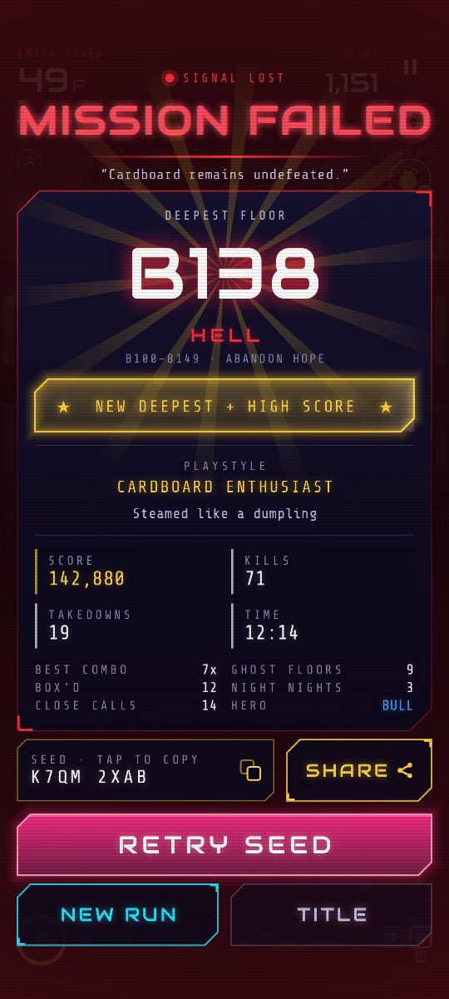<p><em><b>Game over</b>: the depth counts down the building</em></p></td>
  </tr>
</table>

The title screen shows who you're playing as and the difficulty (CHILL, AGENT,
BRUTAL, or **CUSTOM**); **DROP IN** is still one tap. CUSTOM opens the
**Custom run** screen: start from any preset's curve (Straight to Hell
included), tweak it while the chart redraws, see what it feels like next to the
presets, and drop in from right there. Your curve is kept when you go back to
a preset. Seeds, sound and controls live in **Settings**.
Tap the hero bar to open the picker: swipe (or tap the roster) through all
four heroes, each on their own stage with their theme playing, and see their
trait and three hero-only perks. The pick sticks between runs, and the demo
behind the title stars them.

## Difficulty and seeds

Everything scales from one number, **heat**: enemy reaction time, fire rate,
bullet speed, hit points, how many guards each hallway gets, how often doors
spit out reinforcements, and how many hazards a hallway has. Each zone adds
its own bonus, and Hell adds a lot. Pick a preset or shape your own curve:

- **Chill:** slow ramp, 5 hearts.
- **Agent:** the intended descent.
- **Brutal:** hot start, steep ramp, 2 hearts.
- **Custom:** starting heat, ramp, heat cap, hearts, and the zone you start in,
  with a live preview of the curve. Start from any preset, or from
  **Straight to Hell**: start in Hell, at B100. Good luck.

Seeds (in Settings) can be **random**, **daily** (same building for everyone,
UTC), or any word or number you type.

## Sound

The soundtrack is synthesized live: band-limited oscillators, filters,
drums, delay and reverb. Every zone gets its own procedural track, with its
own key, tempo and motif-based melodies. The music gets more intense in a
fight and pitches down in slow-mo. SILENT gets its own sneak mix of every
zone: the same key and chords at a slow tempo over a heartbeat kick, a roomy
snare, ticking hats and glassy bell notes in a long echo, with rim clicks
creeping in as guards get suspicious. Flipping the mode crossfades between
the two. Getting spotted plays a sharp "!" sting and throws the music into
ALERT (full drums and lead; in SILENT, the sneak mix gives way to the zone's
full track). Once they lose you it stays tense through CAUTION for a few
seconds, then calms down. Takedowns get a strangled grunt. Every sound effect is
synthesized too, panned to where it happened on screen, with haptics on the
big moments.

Every hero brings their own band to every zone, in both modes, and signs off
the game over in their own style. **BULL** plays heavy hip-hop: a slow,
menacing boom-bap head-nod while sneaking (fat dusty kick, cracking snare, deep
sub, a dark felt-piano riff), then heavy trap when the guns come out:
distorted, gliding 808s, rolling hats, dark bells and brass, and when the fight
heats up the beat holds its breath for one beat, then drops. **FOX** plays an
early-90s street-brawler soundtrack, all FM synths: a smooth late-night new-jack
swing of electric piano, slap bass and a sultry lead, then a breakbeat rave of
piano-house stabs, a bouncing bass and bright brass that drops hard when the
heat climbs. **HAWK**'s radio is stuck on the courier's
station: elevator-muzak bossa nova (nylon guitar, vibraphone, a cross-stick
clave and a soft flute), then 70s delivery-van funk with ghost-note breakbeats,
slap bass, wah clavinet, horn stabs and a cop-show lead; his game over is a
van-horn beep-beep and a doorbell. Delivered. **MONKEY** ran away from the circus back to the jungle, and
brought the calliope: sneaking is a jungle night of key-tuned bongos and congas,
a shaker, crickets, a wooden marimba and the odd monkey "hoo"; with guns hot it's
a stampede of pounding war drums, log drums and balafon runs with the circus's
steam calliope screaming on top and slide whistles through every fill. His game
over goes "ooh-ooh-AAH!", then "ta-DAAA!", then a sad slide whistle.
The hero picker plays each one's theme. Every tune is original.

## Install

Grab `bout-that-action.apk` from the [latest release](../../releases/latest)
and sideload it. The release also carries `bout-that-action.aab`, the same
build as a Google Play bundle; see [`docs/PLAY_STORE.md`](docs/PLAY_STORE.md). Every push to `main` publishes a single date-labeled release
(`vYYYY.MM.DD.N`) and deletes the previous one; verify it with the attached
`.sha256`. Releases need the signing secrets described in `AGENTS.md`. Until
they're set, CI builds and tests but publishes nothing.

Android 12 (API 31) or newer. It's built for the latest Android and runs on
older versions only where that needs no compatibility code (see `AGENTS.md`). The only permission is vibration, and it collects nothing
([privacy policy](docs/PRIVACY.md)).

It's a game to Android (`appCategory="game"`), so it keeps its portrait lock on
tablets and unfolded foldables too; a window that still isn't tall enough (a
desktop or split-screen window) plays in a centred portrait column. A run pauses
itself when the window loses focus (the notification shade, the other app in
split screen), when a call or another app takes the audio, and when headphones
are unplugged. Back pauses a run (and resumes it from the pause menu); on the
title it leaves the game. Phones whose motor can't play crisp haptic primitives get the
closest standard click instead.

## Build and test

```sh
./gradlew lint test assembleDebug   # what CI runs (plus assembleRelease bundleRelease)
./gradlew :app:screenshots          # re-render docs/screenshots
./gradlew :app:menuShots            # render the Compose menus to app/build/menushots
                                    # (Robolectric; -PallDevices, -Ponly=title,pause)
```

The whole game (simulation, touch controls, renderer and synth) is pure
Kotlin behind small interfaces, so it's tested on the JVM:

- `MechanicsTest`: every rule, one scripted situation at a time (takedowns,
  GUNS HOT auto-fire, SILENT, the mode toggle and its bonus, box vs high
  shots, jumping low shots, doorways, patrol beats, passages, taps that do
  nothing, elevators that only go down, expresses, calling a car, boxing up
  in the car, stashes, swatting lamps, stomps, grenades, combos, no
  stairs, death, replays).
- `ControlsTest`: input buffering, the hit-grace window, the jump arc,
  turnarounds, auto-aim intent, tap and swipe context, door and car exits.
- `HeroTest`: every hero trait and every hero perk, and that a STASH only
  ever offers a hero their own three.
- `StealthAndEventsTest`: napping guards, the box double-take and the kick,
  guards who see you hide and come find you, locked stashes, GHOST, special
  floors, the arrival grace, coach tips, the run report.
- `LevelGenTest`: determinism, a reachable ride down from every hallway on
  24,000 floors, rides arriving in hallway A, passage pairs, door spacing,
  shaft consistency, zone order, the heat curve.
- `GestureInputTest`: taps (never grenades), flicks mid-run, instant reversal,
  two-thumb play, run takeovers, and jumps that never flip the run.
- `BotPlaythroughTest`: an autopilot plays full runs on every preset in both
  modes and prints a balance report (floors, seconds and encounters per
  floor, deaths; every hero on AGENT, so no hero runs away with it) and a pacing report (seconds per floor and hallway,
  elevator waits, dead time, the first minute, what hurt you and whether it
  was an ambush or an arrival). The same autopilot plays the demo behind the title screen.
- `WorldFuzzTest`: minutes of random thumbs on every preset.
- `ScreenshotTest`: renders the README screenshots headlessly through the
  real renderer, using a `java.awt` backend.
- Audio tests: DSP, music theory, levels, determinism, and a check that it
  renders faster than real time.
- `GameplaySmokeTest` (emulator): drops into a run and plays with injected
  touches. Runs on an API 37 emulator on demand and weekly; not a merge
  gate, since emulators are slow and flaky.

## License

MIT. Fonts: Audiowide and Share Tech Mono, both under the SIL Open Font
License (`licenses/`).
